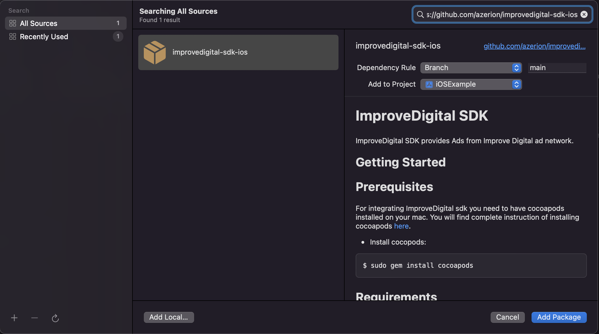
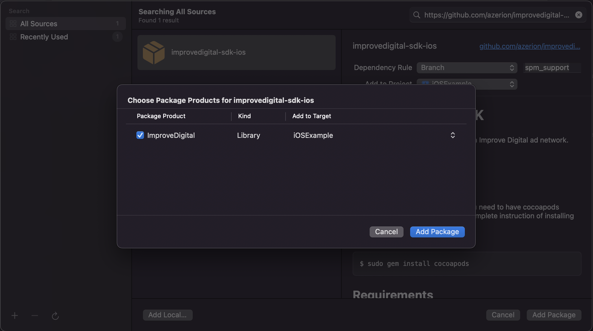
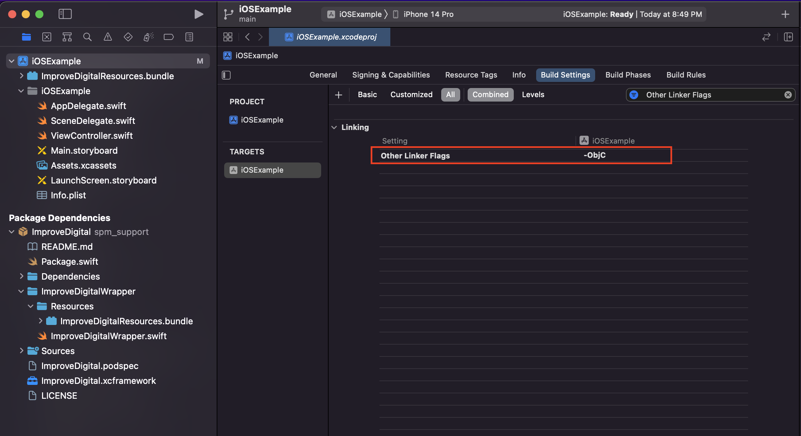

# **ImproveDigital SDK**
ImproveDigital SDK provides Ads from Improve Digital ad network.

## Getting Started

## **Prerequisites**
For integrating ImproveDigital sdk you need to have cocoapods installed on your mac. You will find complete instruction of installing cocoapods [here](https://guides.cocoapods.org/using/getting-started.html).
* Install cocopods:
```
$ sudo gem install cocoapods
```
## **Requirements**
* iOS 11.0 or later
* macOS 10.11 or later
* Xcode 11.0 or later

## **Installation**
[CocoaPods](https://cocoapods.org/) is a dependency manager for Objective-C, which automates and simplifies the process of using 3rd-party libraries in your projects. See the [Get Started](https://cocoapods.org/#get_started) section for more details.

### **Podfile**
```
platform :ios, '11.0'
use_frameworks!

pod 'ImproveDigital'
```
**NOTE For Xcode 14:** Xcode 14 no longer set CODE_SIGNING_ALLOWED to NO by default for resource bundles. Unfortunately, you need to assign a development team to each and every Pod target. For this add following code in your Podfile

```ruby
post_install do |installer|
  installer.pods_project.targets.each do |target|
    if target.respond_to?(:product_type) and target.product_type == "com.apple.product-type.bundle"
      target.build_configurations.each do |config|
          config.build_settings['CODE_SIGNING_ALLOWED'] = 'NO'
      end
    end
  end
end
```
**NOTE for Intel based Mac:** Macs with Intel chipset doesn't supports arm64 simulator architecture. If you want to run it on Intel based Macs then you need to add following script on your Podfile.

```ruby
post_install do |installer|
    installer.pods_project.build_configurations.each do |config|
    config.build_settings["EXCLUDED_ARCHS[sdk=iphonesimulator*]"] = "arm64"
 end
end
```

Open terminal and go to the project location. Install pod using below command
```
pod install --repo-update
```

### **Swift Package Manager**
1. Go to File --> Add Packages... and search for ImproveDigital package using following github url:

<https://github.com/azerion/improvedigital-sdk-ios>



Add the ImproveDigital package



2. Add `-ObjC` flag in your `Other Linker Flags` build settings.



## **How To Use**
### **Initialization**
Improve Digital SDK initializes with a `IMDSettings` object. Create a settings object with your preferable values and initialize the sdk like bellow
* Objective-C
```objc
    IMDSettings *settings = [[IMDSettings alloc] init];
    settings.withUserConsent = YES;
    settings.gdprConsentString = @"MY_GDPR_CONSENT_STRING_HERE";
    settings.isCOPPACompliant = YES;
    settings.isTestModeEnabled = YES;
    settings.isDebugModeEnabled = YES;

    [ImproveDigital initializeWithSettings:settings withCompletionHandler:^(IMDAdNetworkStatus *status) {
        
    }];
```
* Swift
```Swift
    let settings = IMDSettings()
    settings.gdprConsentString = "My gdpr consent string here"
    settings.isCOPPACompliant = true
    settings.withUserConsent = true
    settings.isDebugModeEnabled = true

    ImproveDigital.initialize(with: settings) { status in
            
    }
```
It is recommended to initialize ImproveDigital SDK in AppDelegate's `application:didFinishLaunchingWithOptions:`
## **Banner Ad**
`IMDBannerView` can be added both from interface builder or programmatically. 
* **Interface Builder**   
In a view controller Add a view and change it's class to `IMDBannerView` from the `identity inspector`. Create a IBOutlet in your view controller.
* Objective-C
```objc
    @property (weak, nonatomic) IBOutlet IMDBannerView *bannerView;

    self.bannerView.delegate = self;
    self.bannerView.adSize = kIMDSizeBanner;
    self.bannerView.placementId = @"YOUR_PLACEMENT_ID_HERE";
```
* Swift
```Swift
    @IBOutlet weak var bannerView: IMDBannerView!

    self.bannerView.delegate = self
    self.bannerView.adSize = kIMDSizeBanner
    self.bannerView.placementId = "YOUR_PLACEMENT_ID_HERE"
```
* **Programmatically** 

Initialize banner ad using `IMDBannerView` class with your banner ad placement Id, ad size and `IMDBannerViewDelegate`. Then add it as a subview on your view controller's view.
* Objective-C
```objc
    self.bannerView = [[IMDBannerView alloc] initWithPlacementId: @"YOUR_PLACEMENT_ID_HERE" withAdSize: kIMDSizeBanner withDelegate: self];
```
* Swift
```Swift
    self.bannerView = IMDBannerView(placementId: "YOUR_PLACEMENT_ID_HERE", with: kIMDSizeBanner, with: self)
```

To load the banner ad and start auto refresh use following implementation

* Objective-C
```objc
    [self.bannerView loadAd];
    [self.bannerView startAutoRefresh];
```
* Swift
```Swift
    self.bannerView.loadAd()
    self.bannerView.startAutoRefresh()
```

Implement `IMDBannerViewDelegate` to get success and error callbacks.

* Objective-C
```objc
    - (void)onClickedBannerView:(nonnull IMDBannerView *)bannerView {
        
    }

    - (void)onDisplayedBannerView:(nonnull IMDBannerView *)bannerView {
        
    }

    - (void)onFailedToDisplayBannerView:(nonnull IMDBannerView *)bannerView withError:(nonnull IMDError *)error {
    
    }

    - (void)onFailedToLoadBannerView:(nonnull IMDBannerView *)bannerView withError:(nonnull IMDError *)error {
    
    }

    - (void)onLoadBannerView:(nonnull IMDBannerView *)bannerView {
    
    }
```
* Swift
```Swift
    func onLoad(_ bannerView: IMDBannerView) {
        
    }
    
    func onFailed(toLoad bannerView: IMDBannerView, withError error: IMDError) {
        
    }
    
    func onClickedBannerView(_ bannerView: IMDBannerView) {
        
    }
    
    func onDisplayedBannerView(_ bannerView: IMDBannerView) {
        
    }
    
    func onFailed(toDisplay bannerView: IMDBannerView, withError error: IMDError) {
        
    }
```

## **Interstitial Ad**

Initialize interstitial ad using `IMDInterstitialAd` class with `IMDInterstitialAdDelegate`. Create a `IMDInterstitialPlacement`with placement id and placement type. Then load the interstitial ad with the placement. On successful loading you will be notified on `onLoad:` delegate. After loading completed, present your interstitial ad from the top most view controller.
* Objective-C
```objc
    //Initialize interstitial ad
    self.interstitialAd = [[IMDInterstitialAd alloc] initWithDelegate:self];

    //Load interstitial ad
    IMDInterstitialPlacement *placement = [[IMDInterstitialPlacement alloc] initWithPlacementId:@"YOUR_PLACEMENT_ID_HERE"]; withType:IMDInterstitialPlacementType_STATIC];
    [self.interstitialAd loadAdWithPlacement: placement];
    
    //Present interstitial ad on load success
    [self.interstitialAd presentFromRootViewController:topmostViewController];
```
* Swift
```Swift
    //Initialize interstitial ad
    self.interstitialAd = IMDInterstitialAd(delegate: self)
    
    //Load interstitial ad
    let placement = IMDInterstitialPlacement(placementId: "YOUR_PLACEMENT_ID_HERE", with: .STATIC)
    self.interstitialAd.load(with: placement)

    //Present interstitial ad on load success
    self.interstitialAd.present(fromRootViewController: topmostViewController)
```
Implement `IMDInterstitialAdDelegate` for all kind of success and error callbacks

* Objective-C
```objc
    -(void)onLoadInterstitialAd:(IMDInterstitialAd *)ad {
    
    }

    -(void)onFailedToLoadInterstitialAd:(IMDInterstitialAd *)ad withError:(IMDError *)error {
    
    }

    -(void)onClickedInterstitialAd:(IMDInterstitialAd *)ad {

    }

    -(void)onDisplayedInterstitialAd:(IMDInterstitialAd *)ad {
    
    }

    -(void)onFailedToDisplayInterstitialAd:(IMDInterstitialAd *)ad withError:(IMDError *)error {
    
    }

    -(void)onClosedInterstitialAd:(IMDInterstitialAd *)ad {
    
    }
```
* Swift
```Swift
    func onLoad(_ ad: IMDInterstitialAd) {
        
    }
    func onFailed(toLoad ad: IMDInterstitialAd, withError error: IMDError) {
        
    }
    func onDisplayedInterstitialAd(_ ad: IMDInterstitialAd) {
        
    }
    func onFailed(toDisplay ad: IMDInterstitialAd, withError error: IMDError) {
        
    }
    func onClickedInterstitialAd(_ ad: IMDInterstitialAd) {
        
    }
    func onClosedInterstitialAd(_ ad: IMDInterstitialAd) {
        
    }
```

## **Rewarded Video Ad** 

Initialize rewarded video ad using `IMDRewardedVideoAd` class with your rewarded video ad placement Id and `IMDRewardedVideoAdDelegate`. Then load the interstitial ad. On successful loading you will be notified on `onLoad:` delegate. After loading completed, present your rewarded video ad from the top most view controller.

* Objective-C
```objc
    //Initialize rewarded video ad
    self.rewardedAd = [[IMDRewardedVideoAd alloc] initWithPlacementId:@"YOUR_PLACEMENT_ID_HERE" withDelegate:self];
    
    //Load rewarded video ad
    [self.rewardedAd loadAd];

    //Present rewarded video ad on load success
    [self.rewardedAd presentFromRootViewController:topmostViewController];
```
* Swift
```Swift
    //Initialize rewarded video ad
    self.rewardedVideoAd = IMDRewardedVideoAd(placementId: "YOUR_PLACEMENT_ID_HERE", with: self)
    
    //Load rewarded video ad
    self.rewardedVideoAd.load()

    //Present rewarded video ad on load success
    self.rewardedVideoAd.present(fromRootViewController: topmostViewController)
```
Implement `IMDRewardedVideoAdDelegate` for all kind of success, error and reward callbacks

* Objective-C
```objc
    -(void)onLoadAd:(IMDRewardedVideoAd *)ad {
    
    }

    -(void)onFailedToLoadAd:(IMDRewardedVideoAd *)ad withError:(IMDError *)error {
    
    }

    -(void)onClickedAd:(IMDRewardedVideoAd *)ad {
    
    }

    -(void)onDisplayedAd:(IMDRewardedVideoAd *)ad {
    
    }

    -(void)onFailedToDisplayAd:(IMDRewardedVideoAd *)ad withError:(IMDError *)error {
    
    }

    -(void)onClosedAd:(IMDRewardedVideoAd *)ad {
    
    }

    - (void)rewardEarnedOnRewardedVideoAd:(IMDRewardedVideoAd *)ad {
    
    }
```
* Swift
```Swift
    func onLoad(_ ad: IMDRewardedVideoAd) {
        
    }
    
    func onFailed(toLoad ad: IMDRewardedVideoAd, withError error: IMDError) {
        
    }
    
    func onClickedAd(_ ad: IMDRewardedVideoAd) {
        
    }
    
    func onDisplayedAd(_ ad: IMDRewardedVideoAd) {
        
    }
    
    func onFailed(toDisplay ad: IMDRewardedVideoAd, withError error: IMDError) {
        
    }
    
    func onClosedAd(_ ad: IMDRewardedVideoAd) {
        
    }
    
    func rewardEarned(on ad: IMDRewardedVideoAd) {
        
    }
```